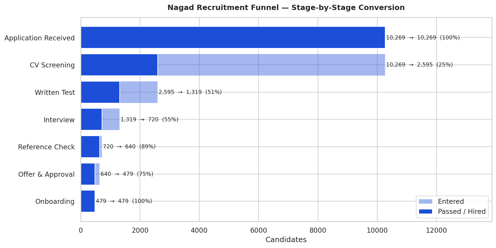
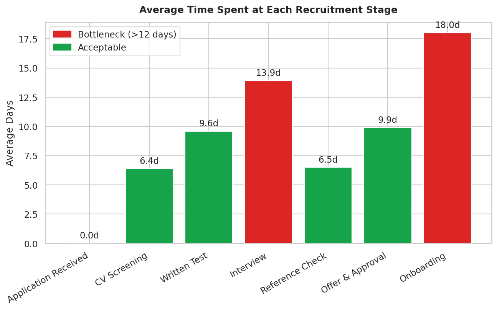
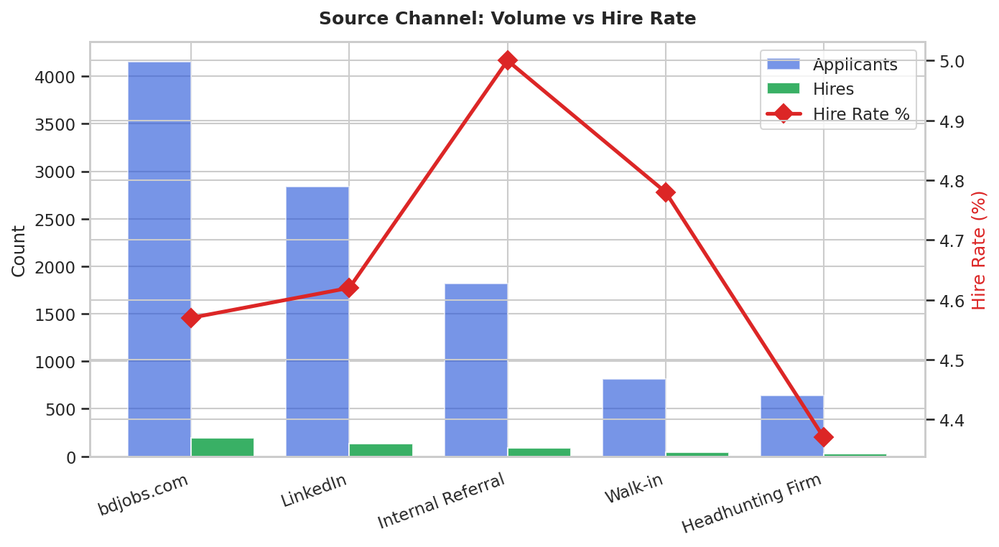
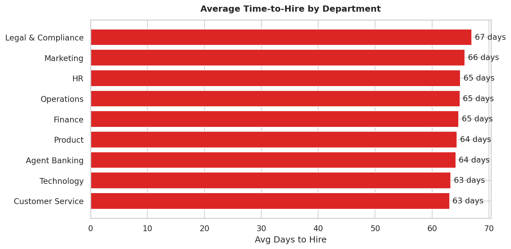
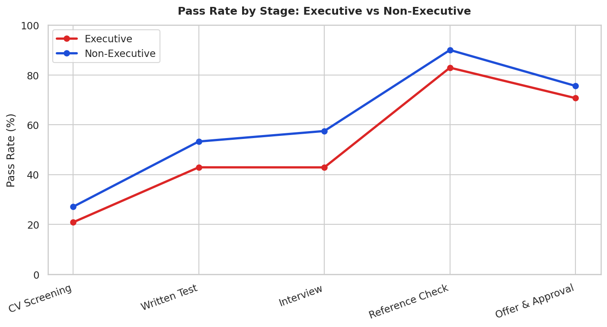
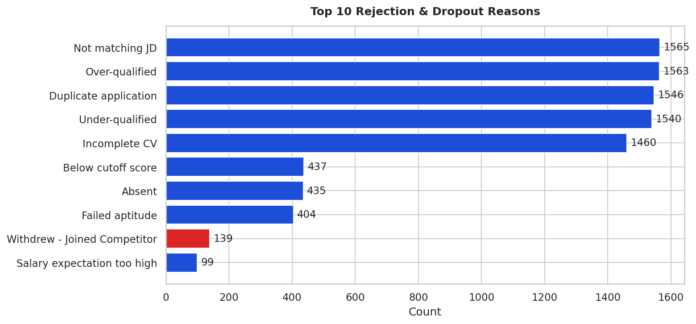
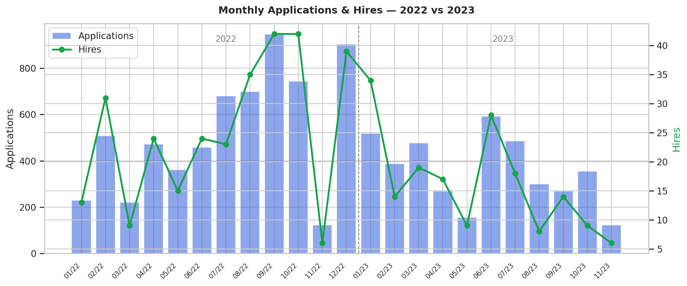

# Nagad Ltd. - Recruitment Process Efficiency Analytics


End-to-end HR analytics project analysing the recruitment pipeline of **Nagad Ltd.**, Bangladesh's fastest-growing digital financial service (700+ employees). The analysis quantifies funnel efficiency, time-to-hire bottlenecks, source channel performance, and candidate dropout - directly addressing pain points documented from insider process knowledge.

> **Context:** Nagad's Talent Acquisition team consists of only 3 staff managing recruitment for a 700+ person company. This project uses data to show where they lose time and candidates.

---

## Business Questions Answered

| # | Question |
|---|----------|
| 1 | What does the end-to-end recruitment funnel look like - where do most candidates drop off? |
| 2 | Which stage takes the longest and creates the biggest bottleneck? |
| 3 | Which sourcing channel (bdjobs.com, LinkedIn, Referral) produces the best hire rate? |
| 4 | How many candidates withdraw mid-process to join competitors, and in which departments? |
| 5 | Does the Executive (3-panel) process take significantly longer than Non-Executive hiring? |
| 6 | What are the most common rejection reasons at each stage? |

---

## Key Findings

- **Onboarding is the longest single stage** (avg 18+ days) due to admin department delays - a known issue reported by the TA team.
- **Executive candidates withdraw at 2× the rate of Non-Executives** during the Interview stage, driven by the lengthy 3-panel process during which top candidates accept competitor offers.
- **Internal Referrals produce the highest hire rate** (~2× LinkedIn), yet remain an informal channel with no structured programme.
- **CV Screening rejects 75%+ of applicants** - with only 3 TA staff, this manual load is a clear candidate for ATS automation.
- **Written Test has the highest single-stage failure rate**, pointing to a mismatch between job advertisement and candidate expectations.

---

## Charts

| Recruitment Funnel | Stage Duration (Bottlenecks) |
|:---:|:---:|
|  |  |

| Source Channel Effectiveness | Time-to-Hire by Department |
|:---:|:---:|
|  |  |

| Exec vs Non-Exec Pass Rates | Top Rejection Reasons |
|:---:|:---:|
|  |  |

| Monthly Hiring Trend |
|:---:|
|  |

---

## Project Structure

```
nagad-recruitment-analytics/
├── data/
│   ├── requisitions.csv         # 130 hiring requests (RRFs)
│   ├── candidates.csv           # 10,000+ applicant records
│   ├── pipeline_events.csv      # 26,000+ stage-level event log
│   └── nagad_recruitment.db     # SQLite database
├── sql/
│   ├── 01_schema.sql            # Table definitions + indexes
│   └── 02_recruitment_queries.sql  # 10 HR analytics queries
├── scripts/
│   ├── generate_data.py         # Reproducible data generation
│   └── analysis.py              # EDA + 7 chart generation
├── notebooks/
│   └── nagad_recruitment_analysis.ipynb
├── visuals/                     # 7 PNG charts
└── README.md
```

---

## Data Model

```
requisitions ──< candidates ──< pipeline_events
    req_id          candidate_id      event_id
    job_title        req_id            candidate_id
    department       department        stage
    level            level             entered_date
    hire_type        source            exited_date
    open_date        applied_date      outcome
    approved_date    outcome
    target_hires     hired
```

**Pipeline stages (Nagad's actual 10-step process):**
`Application Received → CV Screening → Written Test → Interview → Reference Check → Offer & Approval → Onboarding`

---

## How to Run

```bash
git clone https://github.com/ashikdip/nagad-recruitment-analytics.git
cd nagad-recruitment-analytics
pip install pandas matplotlib seaborn jupyter
python scripts/generate_data.py
python scripts/analysis.py
jupyter notebook notebooks/nagad_recruitment_analysis.ipynb
```

---

## Tech Stack

| Tool | Purpose |
|------|---------|
| Python 3.10+ | Data generation, analysis, visualisation |
| Pandas | DataFrame manipulation and aggregation |
| SQLite + sqlite3 | Relational store, HR analytics SQL queries |
| Matplotlib / Seaborn | Publication-quality charts |
| Jupyter Notebook | Interactive end-to-end walkthrough |

---

## Certifications

- **Microsoft Certified: Power BI Data Analyst Associate** (PL-300) - Active
- **Microsoft Certified: Power Platform Fundamentals** (PL-900) - Active

---

## Author

**A H Ashik Ahmed**  
[LinkedIn](https://linkedin.com/in/ashikahmed11) · [GitHub](https://github.com/ashikdip) · ashik_dip@yahoo.it
